# Email Security Agents 🚀

This project demonstrates an **Email Security Agent system** built using the Google ADK framework.
I updated my previous project [Phishing-Email-Detecting](https://github.com/Venksaiabhishek/Phishing-Email-Detecting) by adding a **multi-agent system** using the Google ADK framework.  

- My earlier project focused on phishing detection using ML models (`logistic_regression.joblib` + `tfidf_vectorizer.joblib`).  
- In this project, I extended that work into a **multi-agent framework** where agents run in both **sequential** and **parallel** workflows.  
- The system now handles **phishing email classification, link checking, attachment analysis, explanation, and advice generation** in a structured pipeline.  

This makes the solution more modular, scalable, and closer to how real-world email security systems work.  

---

## 🖼️ Conversation Snapshot
Here’s an example chat session with the agents:

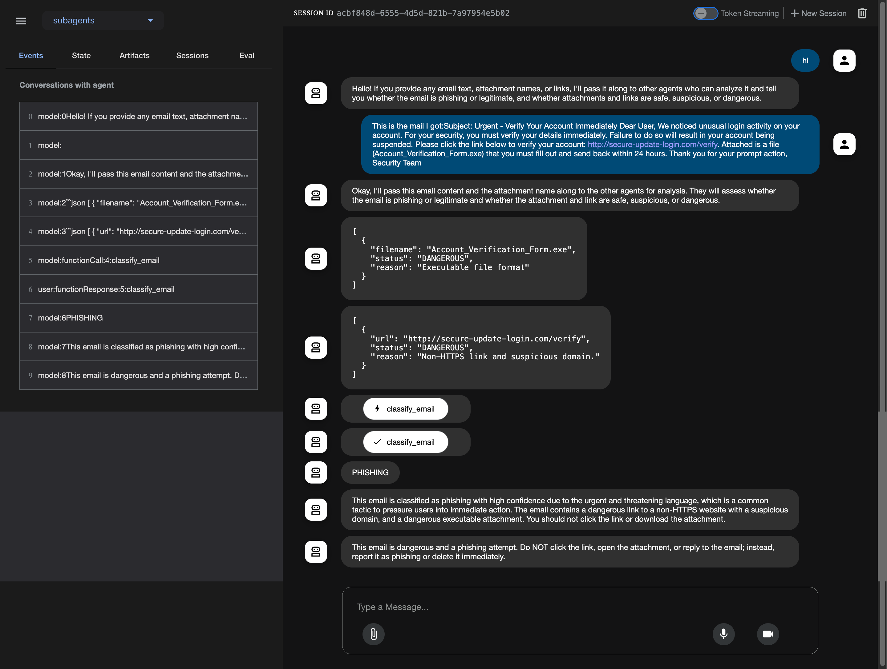

---
### Event Flow – Page 1

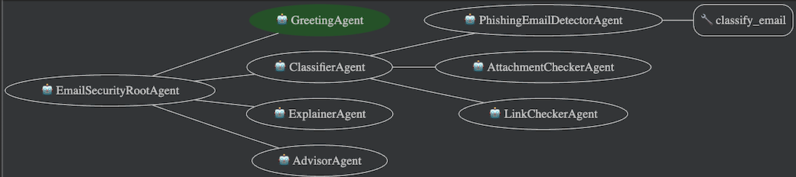

This event flow shows how the **Email Security Agent system** is structured:

- **SequentialAgent Framework** is used for:
  - **GreetingAgent** → Handles user greetings and routes input.
  - **ClassifierAgent** → Coordinates the parallel checks.
  - **ExplainerAgent** → Summarizes the classification process and results.
  - **AdvisorAgent** → Provides final security recommendations to the user.

- **ParallelAgent Framework** is used for:
  - **PhishingEmailDetectorAgent** → Detects phishing emails.
  - **AttachmentCheckerAgent** → Analyzes file attachments.
  - **LinkCheckerAgent** → Inspects links/URLs.

- **Function Tool: `classify_email`**
  - Tools are created by you and tailored to your application.
  - Functions/Methods are defined as standard synchronous functions (e.g., Python `def`) in the code.
  - Here, `classify_email` is the function tool used to trigger email classification.

- **Model Files Used**
  - For the **PhishingEmailDetectorAgent**, I integrated models from my earlier project:  
    - `logistic_regression.joblib`  
    - `tfidf_vectorizer.joblib`  
  - These were imported directly from my GitHub repository:  
    [Phishing-Email-Detecting](https://github.com/Venksaiabhishek/Phishing-Email-Detecting)

This design ensures that:
- Initial interaction and summary steps follow a **sequential pipeline**.  
- Heavy security analysis tasks (phishing, attachments, links) run **in parallel** for efficiency.  

## 📑 Event Flow Diagram
The detailed session event flow is available as a PDF:  
👉 [Download Event Flow Diagram](event_flow_diagram.pdf)
## 📊 Event Session Flow

Or view it inline below 👇

### Page 1
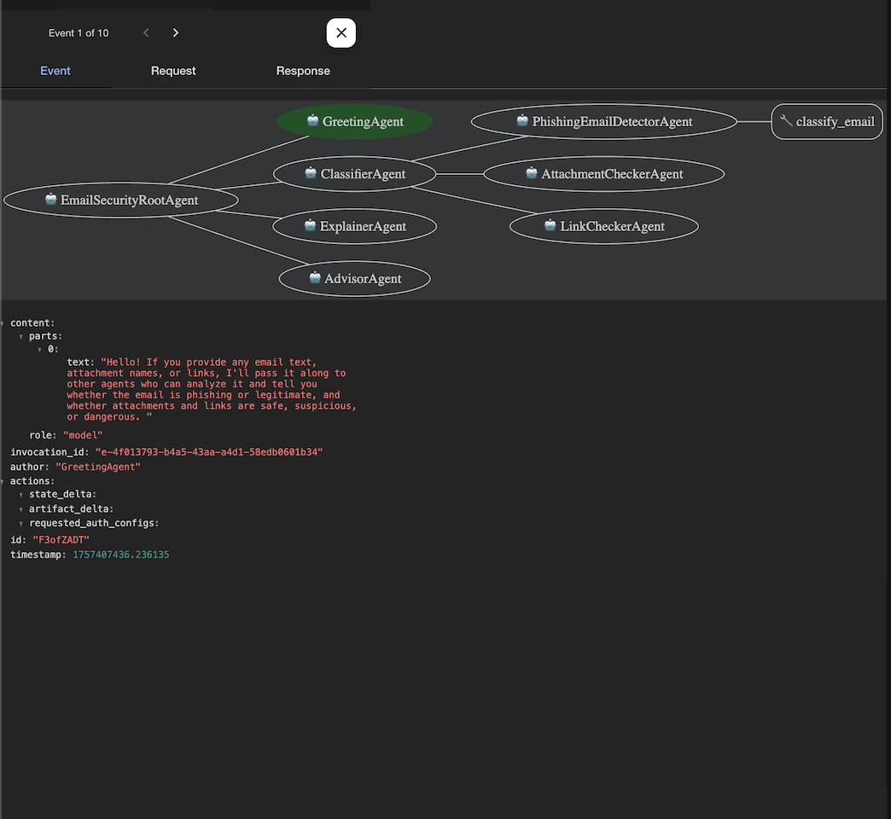

### Page 2
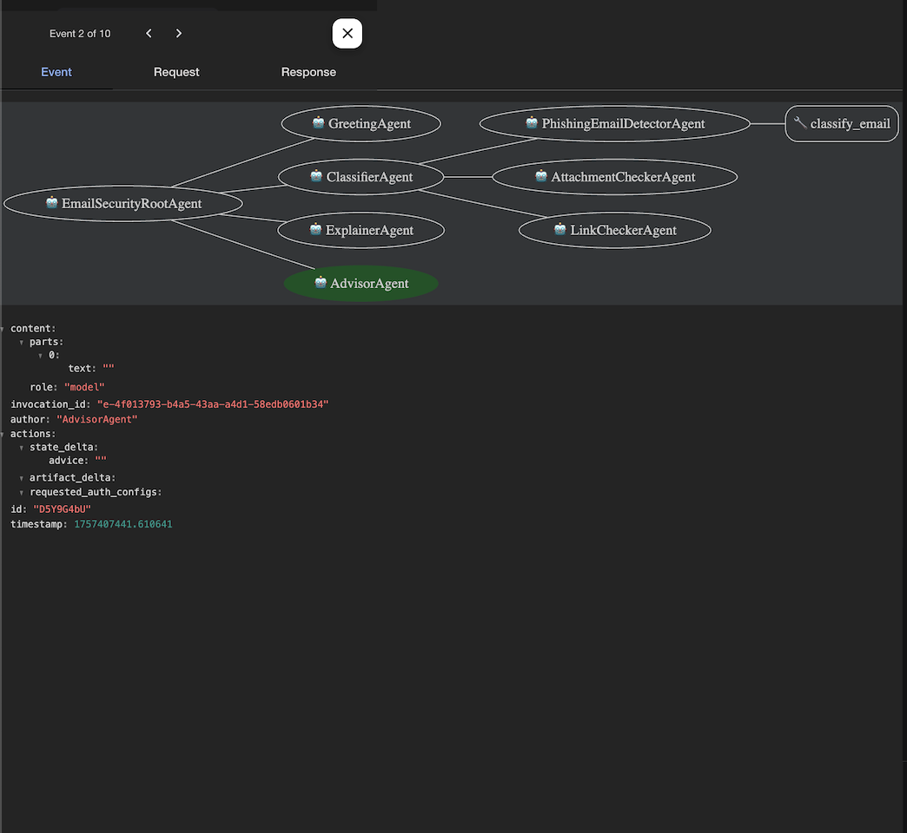

### Page 3
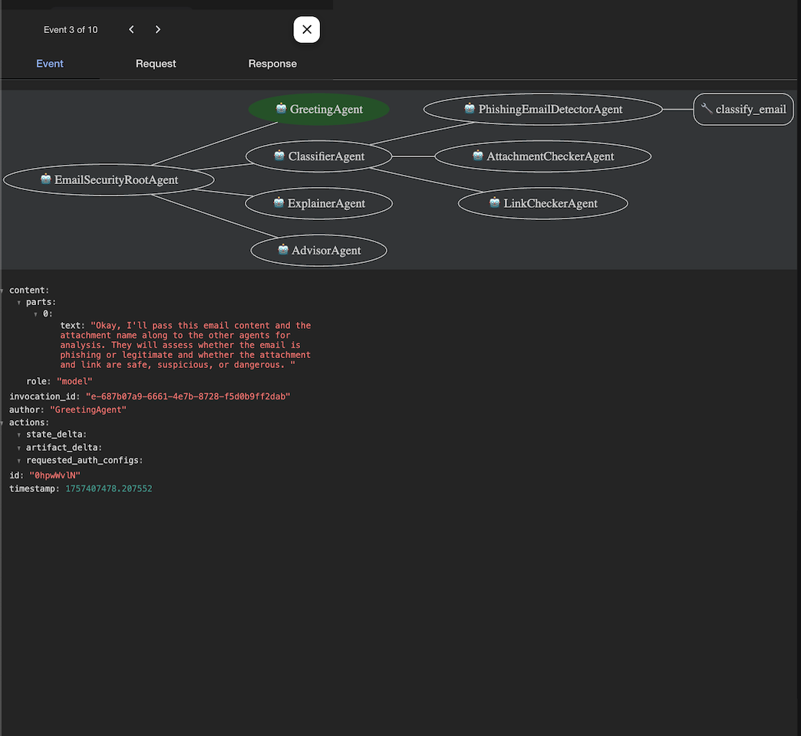

### Page 4
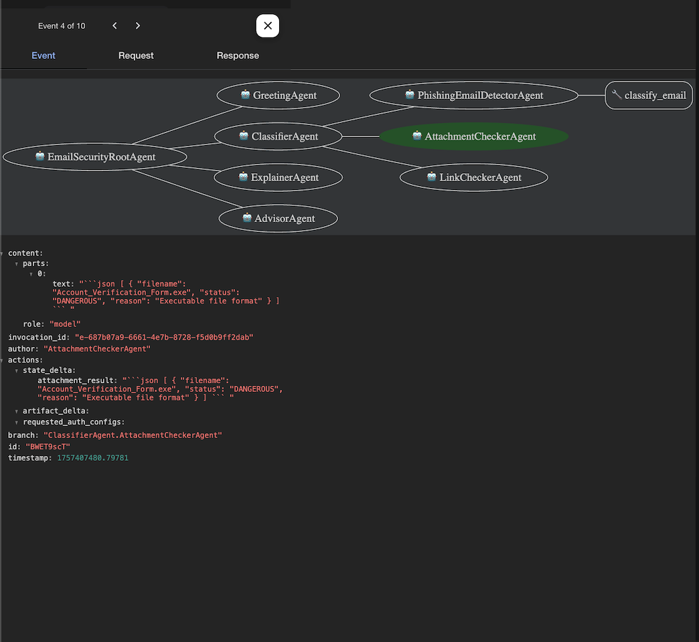

### Page 5
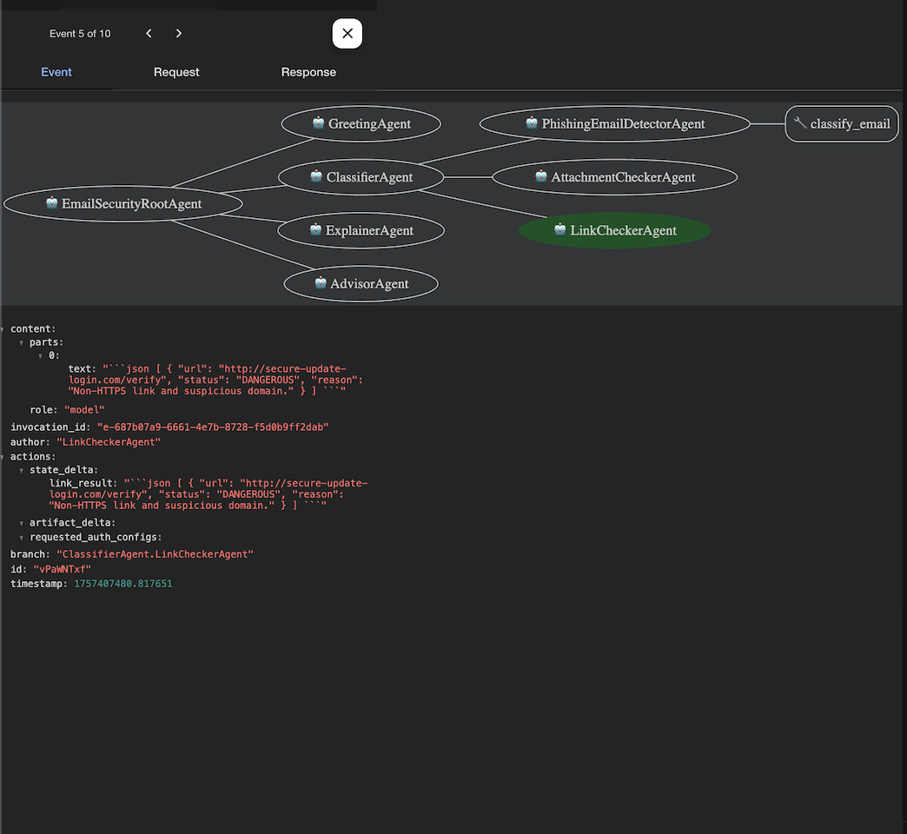

### Page 6

### Page 7
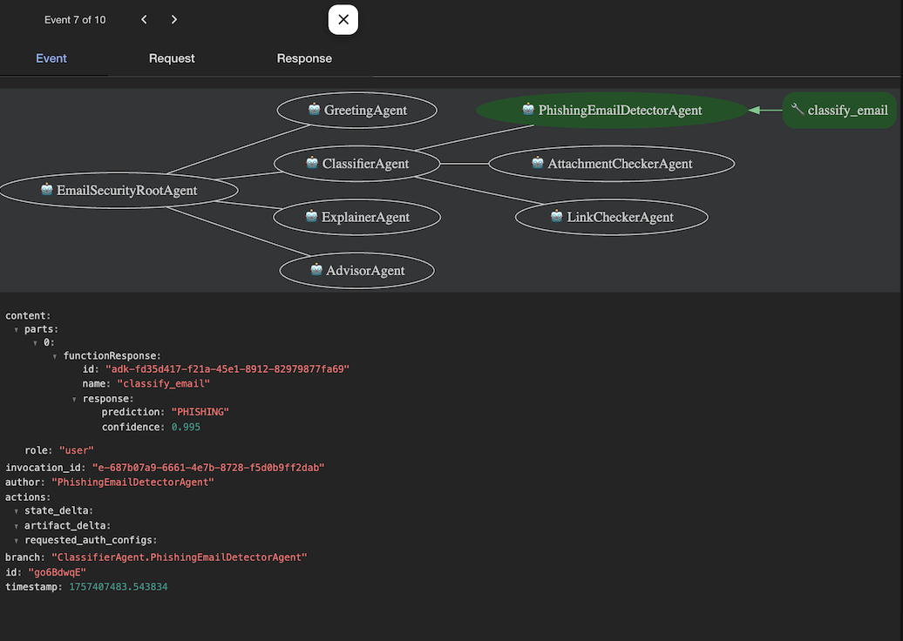

### Page 8
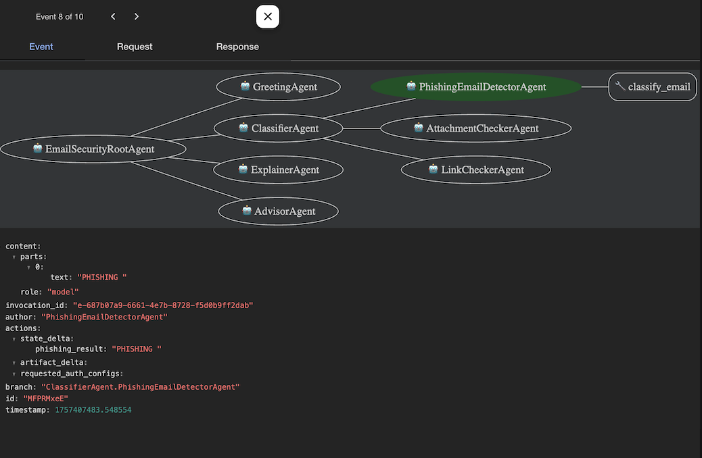

### Page 9
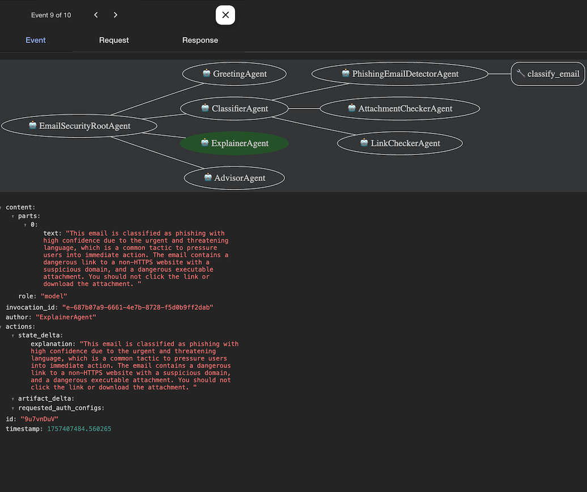

### Page 10
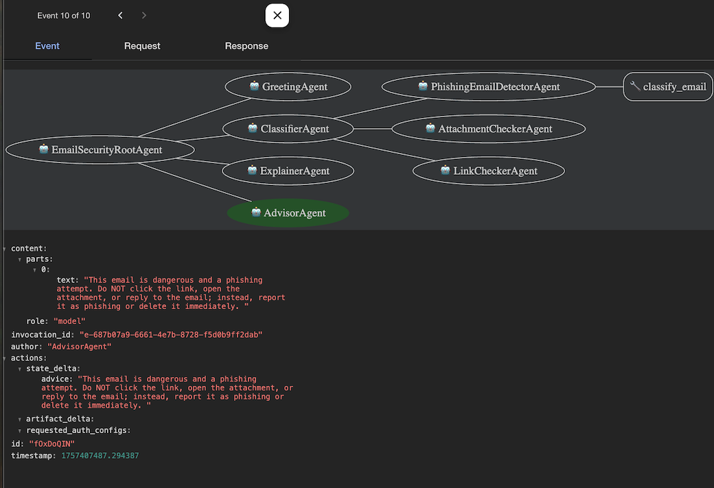
